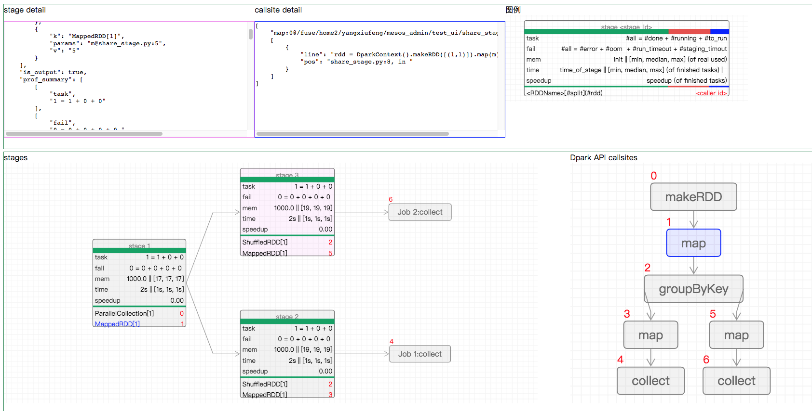
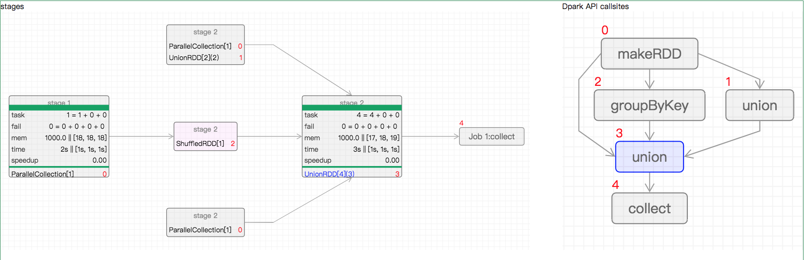

DPark
=====

|pypi status| |ci status| |gitter|

DPark is a Python clone of Spark, MapReduce(R) alike computing framework
supporting iterative computation.

Installation
------------

.. code:: bash

    ## Due to the use of C extensions, some libraries need to be installed first.

    $ sudo apt-get install libtool pkg-config build-essential autoconf automake
    $ sudo apt-get install python-dev
    $ sudo apt-get install libzmq-dev

    ## Then just pip install dpark (``sudo`` maybe needed if you encounter permission problem).

    $ pip install dpark

Example
-------

for word counting (``wc.py``):

.. code:: python

     from dpark import DparkContext
     ctx = DparkContext()
     file = ctx.textFile("/tmp/words.txt")
     words = file.flatMap(lambda x:x.split()).map(lambda x:(x,1))
     wc = words.reduceByKey(lambda x,y:x+y).collectAsMap()
     print wc

This script can run locally or on a Mesos cluster without any
modification, just using different command-line arguments:

.. code:: bash

    $ python wc.py
    $ python wc.py -m process
    $ python wc.py -m host[:port]

See examples/ for more use cases.

Configuration
------------

DPark can run with Mesos 0.9 or higher.

If a ``$MESOS_MASTER`` environment variable is set, you can use a
shortcut and run DPark with Mesos just by typing

.. code:: bash

    $ python wc.py -m mesos

``$MESOS_MASTER`` can be any scheme of Mesos master, such as

.. code:: bash

    $ export MESOS_MASTER=zk://zk1:2181,zk2:2181,zk3:2181/mesos_master

In order to speed up shuffling, you should deploy Nginx at port 5055 for
accessing data in ``DPARK_WORK_DIR`` (default is ``/tmp/dpark``), such
as:

.. code:: bash

            server {
                    listen 5055;
                    server_name localhost;
                    root /tmp/dpark/;
            }

UI
--

2 DAGs:

1. stage graph: stage is a running unit, contain a set of task, each run same ops for a split of rdd.
2. use api callsite graph

UI when running
~~~~~~~~~~~~~~

Just open the url from log like ``start listening on Web UI http://server_01:40812`` .

UI after running
~~~~~~~~~~~~~~~~~~

1. before run, config LOGHUB & LOGHUB_PATH_FORMAT in dpark.conf, pre-create LOGHUB_DIR.
2. get log hubdir from log like ``logging/prof to LOGHUB_DIR/2018/09/27/16/b2e3349b-9858-4153-b491-80699c757485-8754``, which in clude mesos framework id.
3. run ``dpark_web.py -p 9999 -l LOGHUB_DIR/2018/09/27/16/b2e3349b-9858-4153-b491-80699c757485-8728/``, dpark_web.py is in tools/

UI examples for features
~~~~~~~

show sharing shuffle map output

.. code:: python

   rdd = DparkContext().makeRDD([(1,1)]).map(m).groupByKey()
   rdd.map(m).collect()
   rdd.map(m).collect()

combine nodes iff with same lineage,  form a logic tree inside stage, then each node contain a PIPELINE of rdds.

.. code:: python

   rdd1 = get_rdd()
   rdd2 = dc.union([get_rdd() for i in range(2)])
   rdd3 = get_rdd().groupByKey()
   dc.union([rdd1, rdd2, rdd3]).collect()

More docs (in Chinese)
-------------------------

https://dpark.readthedocs.io/zh_CN/latest/

https://github.com/jackfengji/test\_pro/wiki

Mailing list: dpark-users@googlegroups.com
(http://groups.google.com/group/dpark-users)

.. |pypi status| image:: https://img.shields.io/pypi/v/DPark.svg
   :target: https://pypi.python.org/pypi/DPark

.. |gitter| image:: https://badges.gitter.im/douban/dpark.svg
   :alt: Join the chat at https://gitter.im/douban/dpark
   :target: https://gitter.im/douban/dpark?utm_source=badge&utm_medium=badge&utm_campaign=pr-badge&utm_content=badge

.. |ci status| image:: https://travis-ci.org/douban/dpark.svg
   :target: https://travis-ci.org/douban/dpark
